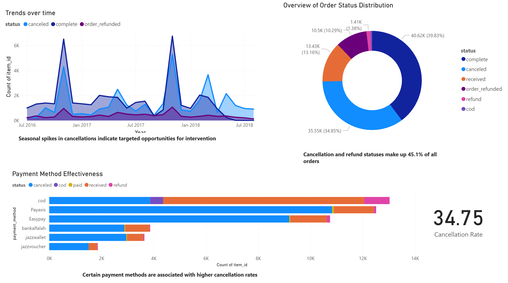

# Pakistan E-commerce Performance Analysis

This repository contains a business intelligence analysis of a major Pakistani e-commerce company. The project dives into a large dataset of customer orders to identify the key drivers behind high rates of order cancellations and refunds, ultimately providing data-driven recommendations to enhance profitability and customer satisfaction.

---

## 📝 Objective

A Pakistani e-commerce company is experiencing a high rate of order cancellations and refunds, which is impacting profitability. The objective of this analysis is to dissect the order data to identify trends and root causes behind these issues. The goal is to propose a data-driven strategy to minimize these occurrences and evaluate the effectiveness of current sales and discount strategies.

---

## 📊 Interactive Power BI Dashboard

A live, interactive Power BI dashboard was created to explore the dataset and its key findings.

**[➡️ View the Live Interactive Dashboard]([https://app.powerbi.com/view?r=eyJrIjoiODc4ZjM4YTQtMzIwYS00M2FmLThmZjUtNTI5ZjUzMTFkNmNlIiwidCI6ImZlZTNiOTE2LTAxYzEtNDk4Ny1hNjQ2LWUxOTM0MzJiOWVhYSIsImMiOjl9](https://app.powerbi.com/view?r=eyJrIjoiYmRlOWQ2MmMtZmQ5Ni00YTAxLTk4MDgtYjRhZjE3NjA1YTcyIiwidCI6ImZlZTNiOTE2LTAxYzEtNDk4Ny1hNjQ2LWUxOTM0MzJiOWVhYSIsImMiOjl9))**

---

## 💾 Dataset

The analysis is based on a comprehensive dataset of e-commerce transactions in Pakistan, originally containing half a million records from March 2016 to August 2018.

* **Source**: [Pakistan's Largest Ecommerce Dataset on Kaggle](https://www.kaggle.com/datasets/zusmani/pakistans-largest-ecommerce-dataset/data)
* **Data Cleaning**:
    * Removed the last five columns due to null values.
    * Eliminated empty rows.
    * For manageability and focus, the dataset was trimmed to 102,292 rows.

The cleaned and reduced dataset used for this analysis is available in this repository (`Reduced_Pakistan_Ecommerce_Dataset.csv`).

---

## 🛠️ Analysis & Tools

The project involved an in-depth exploratory data analysis (EDA) and the creation of an interactive business intelligence dashboard.

* **Languages & Libraries**: **Python** with Pandas for data manipulation and cleaning.
* **Tools**: **Jupyter Notebook** for the EDA process (`pakistan-e-commerce-eda.ipynb`) and **Microsoft Power BI** for data visualization and dashboard creation.

---

## 📈 Key Insights

The analysis of the order data revealed several critical trends:

* **High Cancellation & Refund Rates**: A significant portion of orders result in cancellations or refunds, indicating a critical area for operational improvement.
* **Payment Method Impact**: Cash on Delivery (COD) is a major contributor to order cancellations.
* **Category-Specific Issues**: Certain product categories experience disproportionately high rates of cancellations and refunds.
* **Effect of Discounts**: The effectiveness of store-wide discounts is questionable, as they may not be driving profitable sales.

---

## 💡 BI Recommendations

Based on the analysis, the following data-driven strategies are recommended to mitigate losses and improve performance:

1.  **Revise Payment Policies**: Introduce incentives for prepaid orders or revise policies for high-risk payment methods like COD to reduce cancellation rates.
2.  **Targeted Interventions**: Develop focused strategies to manage the seasonal spikes in cancellations and refunds, such as proactive customer communication.
3.  **Enhance Quality Assurance**: For categories with high refund rates, implement stricter quality checks and provide more accurate product descriptions to better align customer expectations.
4.  **Reassess Discount Structures**: Move away from broad, store-wide promotions and adopt a more targeted discount strategy based on customer behavior and product performance.
5.  **Improve Post-Sales Support**: Bolster customer service for high-value categories prone to refunds to build trust and satisfaction.
6.  **Data-Driven Inventory Management**: Utilize sales and refund data to optimize stock levels, prioritizing high-performing products.
7.  **Systematic Customer Feedback**: Implement a robust system to collect and analyze feedback from canceled and refunded orders to identify specific areas for improvement.
