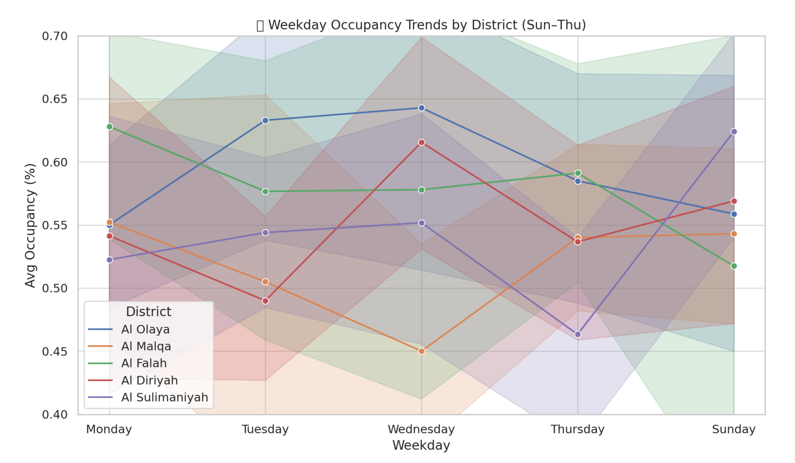
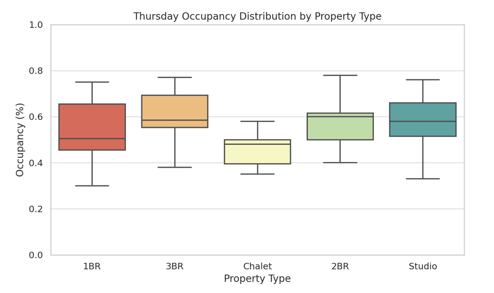
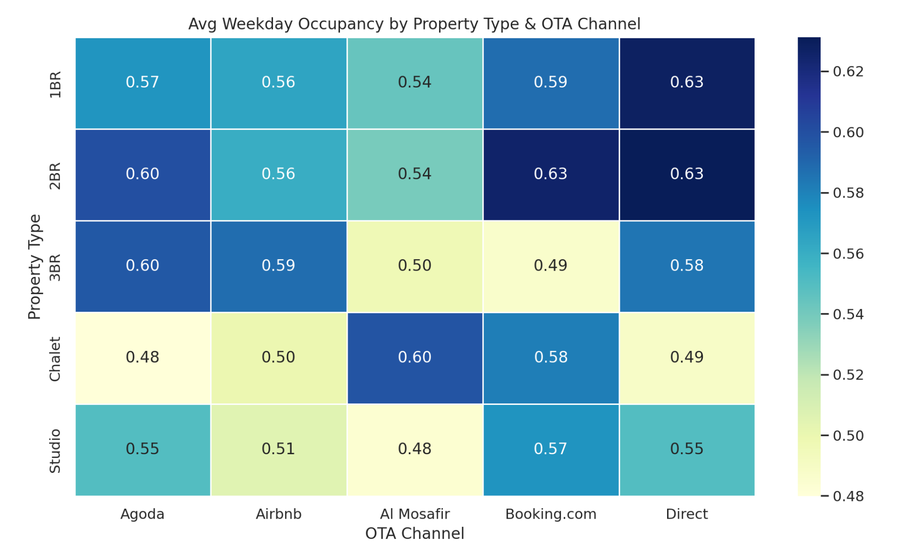

# Riyadh Short-Term Rental: Weekday Occupancy Optimization

This project analyzes booking data for Livedin, a short-term rental company in Riyadh, to solve the business problem of low weekday occupancy and inconsistent revenue. As part of my data analytics portfolio, this case study demonstrates a data-driven approach to revenue optimization.

## 📊 Business Problem & Objectives

Livedin manages a diverse portfolio of short-term rentals (studios, 1BR, 2BR, 3BR apartments, and Chalets) across Riyadh, with revenue managed through various Online Travel Agencies (OTAs) like Airbnb, Booking.com, and Agoda, as well as direct bookings.

The company observed a significant challenge: **weekday (Sunday-Thursday) occupancy levels were consistently falling below 50%**, directly impacting overall revenue and average daily rates (ADR). The primary goal of this project was to identify the root causes of this underperformance and deliver data-driven strategies to boost weekday bookings and optimize ADR.

**Note on Weekday Definition:** In Saudi Arabia, the official weekend is Friday and Saturday. Therefore, in this analysis, 'weekdays' are defined as Sunday through Thursday, aligning with the local business calendar.

## 💡 My Analytical Approach & Methodology

My strategy was to move beyond generic solutions by segmenting the data to uncover specific patterns and actionable insights. I broke down the analysis into four key areas:

1.  **Exploratory Data Analysis (EDA):** To uncover key factors driving low weekday occupancy.
2.  **District-Wise Trends:** To analyze if geographical location played a significant role in demand patterns.
3.  **Property-Type Performance:** To understand if different property types (e.g., business-oriented 1-2BR vs. leisure-focused 3BR, Chalets) exhibited distinct weekday booking behaviors.
4.  **Booking Channel Effectiveness:** To determine which OTA (e.g., Airbnb, Booking.com) was best suited for each property type during weekdays.
5.  **Data Trigger Proposal:** To recommend metrics for real-time monitoring and proactive response to future occupancy challenges.

## 📈 Key Findings & Visualizations

The analysis revealed distinct patterns in weekday occupancy, highlighting opportunities for targeted interventions.

### District-Wise Performance

Analysis of weekday trends by district showed two distinct behaviors. Business-centric districts like **Al Olaya** and **Al Sulimaniyah** saw demand drop sharply on Thursday, marking the end of the workweek. In contrast, other districts like **Al Falah** and **Al Malqa** observed stable or rising Thursday demand, indicating a shift towards pre-weekend leisure traffic.

*Line chart illustrating weekday occupancy trends across different districts in Riyadh.*

### Thursday Occupancy by Property Type

Drilling down into Thursday performance revealed clear differences. Smaller, business-focused units (1BR and 2BR) consistently experienced an occupancy decline on Thursdays. However, larger units like 3BRs and Chalets, which typically underperformed early in the week, stabilized or even saw increased demand on Thursday, confirming the shift toward leisure and group stays ahead of the weekend.

*Box plot showing the distribution of Thursday occupancy rates by property type.*

### Booking Channel (OTA) Effectiveness

The data showed a strong alignment between OTA platform and property type performance during weekdays. **Booking.com** and **Direct bookings** were identified as the top-performing channels for 1BR and 2BR units, aligning with business travel. Conversely, **Al Mosafir** proved to be the most effective platform for Chalets, while **Airbnb** excelled for 3BR apartments, reinforcing their suitability for leisure and group bookings.

*Heatmap visualizing average weekday occupancy across property types and OTA channels.*

## 📝 Strategic Recommendations & Proactive Triggers

Based on these findings, I proposed a set of targeted actions designed to optimize weekday performance and revenue, moving beyond generic discount strategies.

### Strategic Recommendations

1.  **Promote Larger Units on Thursdays:** Actively market Chalets and 3BRs on platforms like Al Mosafir and Airbnb, branding them as "pre-weekend getaways" to capture the leisure market. Introduce bundle offers like "Stay Thursday, Get Friday 50% Off" for larger units.
2.  **Optimize Business Listings:** Focus marketing efforts for 1BR/2BR units on Booking.com and Direct channels from Sunday to Wednesday. Consider pausing or reducing Thursday ads for these smaller units in business districts such as Al Sulimaniyah and Al Olaya. Optimize 2BR and 1BR weekday packages on Booking.com and Direct.
3.  **Implement Dynamic Pricing:** Apply 10 to 15 percent weekday discounts on low-performing larger units to stimulate demand.
4.  **Improve Low-Rated Listings:** Conduct an audit of all properties rated below 4.2, as guest satisfaction directly impacts weekday occupancy. Implement guest service improvements or consider rebranding where necessary.
5.  **Refine OTA Titles and Metadata:** Use terms like 'Business-friendly' or 'Group Stay' in listing descriptions to attract target segments.
6.  **Encourage Loyalty:** Implement loyalty programs and repeat stay incentives by offering weekday perks (e.g., free early check-in, loyalty vouchers).
7.  **Align OTA Usage:** Reinforce the strategy of using Booking.com for business units, Al Mosafir for Chalets, and Airbnb for 3BRs based on their proven effectiveness.

### Trigger Metrics for Proactive Response

To ensure continuous optimization and real-time responsiveness to market changes, I proposed the implementation of specific data triggers:

* **Trigger: Occupancy Drop**
    * **Threshold:** Average occupancy less than 50% for 2 consecutive weeks.
    * **Action:** Trigger pricing model to reduce Average Daily Rate (ADR) by 10-15%.
* **Trigger: Guest Rating Risk**
    * **Threshold:** Rating below 4.0 and occupancy below 55%.
    * **Action:** Flag property for immediate operations audit and guest service response.
* **Trigger: ADR Overpricing**
    * **Threshold:** ADR over 20% above market average and occupancy below 50%.
    * **Action:** Launch a targeted discount campaign and re-optimize the listing.
* **Trigger: Underperforming OTA**
    * **Threshold:** Conversion rate below 50% of peer listings on the same platform.
    * **Action:** Pause ads on that OTA, reassess listing copy, and potentially shift advertising budget to higher-performing channels.
