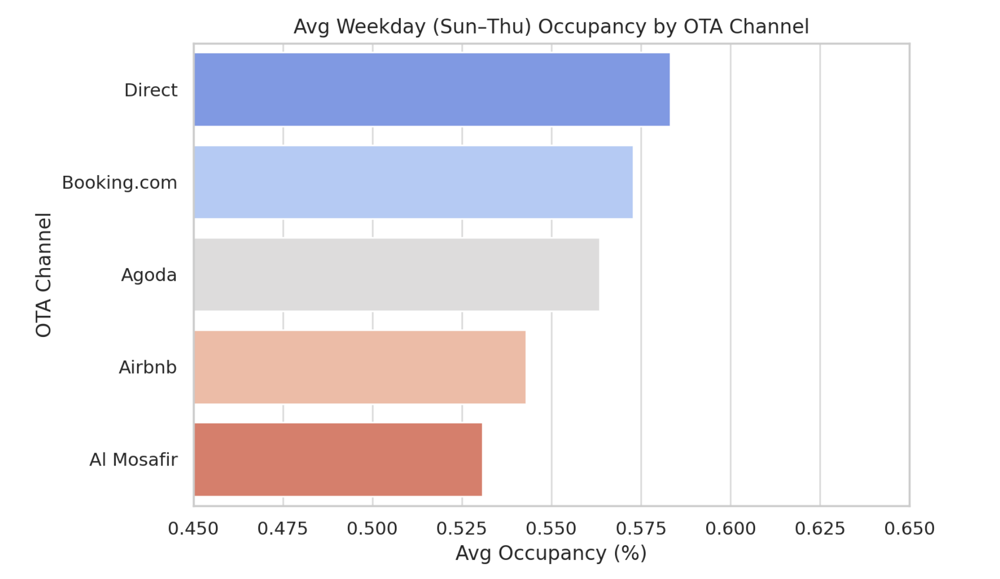

# Riyadh Short-Term Rental: Weekday Occupancy Optimization

This project is a key part of my data analytics portfolio, presenting a case study focused on understanding and addressing low weekday occupancy and inconsistent revenue for a short-term rental company in Riyadh. The objective was to use data-driven insights to identify the most influential factors affecting booking patterns, paving the way for targeted and effective revenue optimization strategies.

## 📊 Business Problem & Objectives

Livedin manages a diverse portfolio of short-term rentals (studios, 1BR, 2BR, 3BR apartments, and Chalets) across Riyadh, with revenue managed through various Online Travel Agencies (OTAs) like Airbnb, Booking.com, and Agoda, as well as direct bookings.

The company has observed a significant challenge: **weekday (Sunday-Thursday) occupancy levels were consistently falling below 50%**, directly impacting overall revenue and average daily rates (ADR). The primary goal of this project was to identify the root causes of this underperformance and deliver data-driven strategies to boost weekday bookings and optimize ADR.

**Note on Weekday Definition:** In Saudi Arabia, the official weekend is Friday and Saturday. Therefore, in this analysis, 'weekdays' are defined as Sunday through Thursday, aligning with the local business calendar.

## 💡 My Analytical Approach & Methodology

My strategy was to move beyond generic solutions by segmenting the data to uncover specific patterns and actionable insights. I broke down the analysis into several key areas:

1.  **Data Preparation & Wrangling:** Cleaning and structuring the raw data for analysis.
2.  **Exploratory Data Analysis (EDA):** Deep-diving into the data to uncover key factors driving low weekday occupancy.
3.  **District-Wise Trends:** Analyzing if geographical location played a significant role in demand patterns.
4.  **Property-Type Performance:** Understanding if different property types (e.g., business-oriented 1-2BR vs. leisure-focused 3BR, Chalets) exhibited distinct weekday booking behaviors.
5.  **Booking Channel Effectiveness:** Determining which OTA (e.g., Airbnb, Booking.com) was best suited for each property type during weekdays.
6.  **Data Trigger Proposal:** Recommending metrics for real-time monitoring and proactive response to future occupancy challenges.

### Data Preparation & Wrangling

Before analysis, the raw data underwent several cleaning and preparation steps, detailed in the `notebooks/eda.ipynb` notebook:
* Mapped missing nationality name rows using a separate nationality code reference.
* Mean-imputed 2 missing "age at enrollment" rows to ensure data completeness.
* Replaced a single inconsistent "girl" value with "female" to standardize gender entries.

### Exploratory Data Analysis (EDA)

For the EDA phase, detailed in the `notebooks/eda.ipynb` notebook, I employed various methodologies and utilized key Python libraries to understand the dataset's characteristics, identify patterns, and prepare for modeling:

* **Statistical Tests:** Performed tests such as Tukey's HSD, T-tests, and ANOVA to statistically assess the significance of differences between groups and the impact of various variables on occupancy and ADR.
* **Correlation Analysis:** Used correlation matrices to identify relationships between numerical variables, helping to pinpoint highly significant and strongly correlating columns that became primary focuses for visualization.
* **Data Aggregation & Segmentation:** Grouped data by dimensions like district, property type, and booking channel to observe trends and performance metrics.
* **Outlier Detection:** Identified and addressed outliers that could skew analysis results.

**Libraries Used:**
* **Pandas:** For data manipulation, cleaning, and aggregation.
* **NumPy:** For numerical operations and array manipulation.
* **Matplotlib & Seaborn:** For creating static, interactive, and animated visualizations to explore data distributions and relationships.
* **SciPy / Statsmodels:** For conducting statistical tests (e.g., T-tests, ANOVA).

### Dashboard Creation

The insights were visualized using a Power BI dashboard. Emphasis was placed on a high data-ink ratio to efficiently use dashboard space, and an overall consistent color theme was maintained.

## 📈 Key Findings & Visualizations

The analysis revealed distinct patterns in weekday occupancy and revenue, highlighting opportunities for targeted interventions.

Analysis of weekday trends by district showed two distinct behaviors. Business-centric districts like **Al Olaya** and **Al Sulimaniyah** saw demand drop sharply on Thursday, marking the end of the workweek. In contrast, other districts like **Al Falah** and **Al Malqa** observed stable or rising Thursday demand, indicating a shift towards pre-weekend leisure traffic.

*Line chart illustrating weekday occupancy trends across different districts in Riyadh.*

### Overall Weekday Occupancy by OTA Channel

Understanding the performance of each Online Travel Agency (OTA) channel is crucial for optimizing booking strategies. This chart provides an overall view of weekday occupancy rates achieved through different platforms.

*Bar chart displaying the average weekday occupancy percentage across various OTA channels.*

### Booking Channel (OTA) Effectiveness by Property Type

This heatmap provides a granular view of how effectively each OTA platform performs for specific property types during weekdays, allowing for targeted channel optimization.

*Heatmap visualizing average weekday occupancy across property types and OTA channels.*

## 📝 Strategic Recommendations & Proactive Triggers

Based on these findings, I proposed a set of targeted actions designed to optimize weekday performance and revenue, moving beyond generic discount strategies.

### Strategic Recommendations

1.  **Promote Larger Units on Thursdays:** Actively market Chalets and 3BRs on platforms like Al Mosafir and Airbnb, branding them as "pre-weekend getaways" to capture the leisure market. Introduce bundle offers like "Stay Thursday, Get Friday 50% Off" for larger units.
2.  **Optimize Business Listings:** Focus marketing efforts for 1BR/2BR units on Booking.com and Direct channels from Sunday to Wednesday. Consider pausing or reducing Thursday ads for these smaller units in business districts such as Al Sulimaniyah and Al Olaya. Optimize 2BR and 1BR weekday packages on Booking.com and Direct.
3.  **Implement Dynamic Pricing:** Apply 10 to 15 percent weekday discounts on low-performing larger units to stimulate demand.
4.  **Improve Low-Rated Listings:** Conduct an audit of all properties rated below 4.2, as guest satisfaction directly impacts weekday occupancy. Implement guest service improvements or consider rebranding where necessary.
5.  **Refine OTA Titles and Metadata:** Use terms like 'Business-friendly' or 'Group Stay' in listing descriptions to attract target segments.
6.  **Encourage Loyalty:** Implement loyalty programs and repeat stay incentives by offering weekday perks (e.g., free early check-in, loyalty vouchers).
7.  **Align OTA Usage:** Reinforce the strategy of using Booking.com for business units, Al Mosafir for Chalets, and Airbnb for 3BRs based on their proven effectiveness.

### Trigger Metrics for Proactive Response

To ensure continuous optimization and real-time responsiveness to market changes, I proposed the implementation of specific data triggers for Livedin's operations:

* **Trigger: Occupancy Drop**
    * **Threshold:** Average occupancy less than 50% for 2 consecutive weeks.
    * **Action:** Trigger pricing model to reduce Average Daily Rate (ADR) by 10-15%.
* **Trigger: Guest Rating Risk**
    * **Threshold:** Rating below 4.0 and occupancy below 55%.
    * **Action:** Flag property for immediate operations audit and guest service response.
* **Trigger: ADR Overpricing**
    * **Threshold:** ADR over 20% above market average and occupancy below 50%.
    * **Action:** Launch a targeted discount campaign and re-optimize the listing.
* **Trigger: Underperforming OTA**
    * **Threshold:** Conversion rate below 50% of peer listings on the same platform.
    * **Action:** Pause ads on that OTA, reassess listing copy, and potentially shift advertising budget to higher-performing channels.
