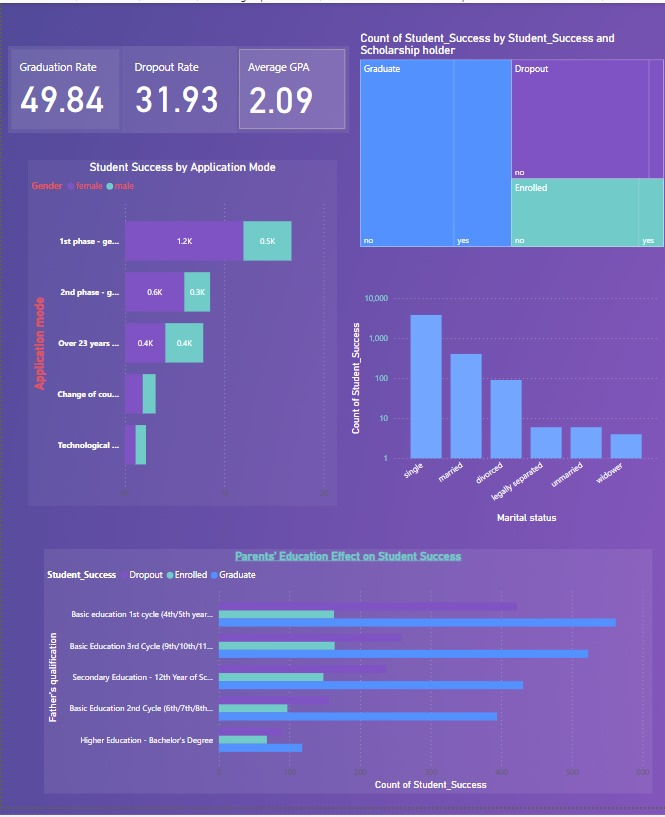
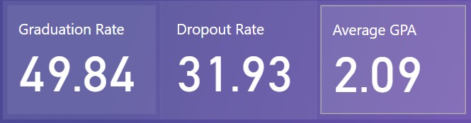
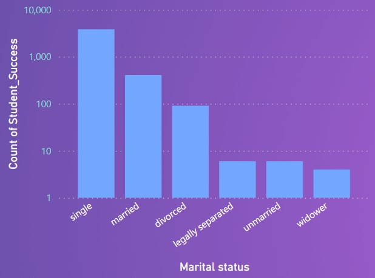
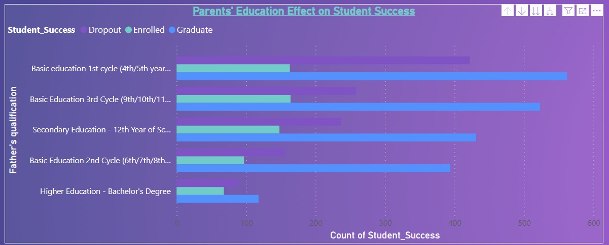

# Student Success Analysis: Identifying Predictive Factors & Improving Outcomes

This project is a key part of my data analytics portfolio, presenting a case study focused on understanding and addressing high dropout rates and low graduation rates at an educational institution. The objective was to use data-driven insights to identify the most influential factors affecting student success, paving the way for targeted and effective support programs.

## 📊 The Business Problem

The institution faced a significant challenge: a **dropout rate of 31.93%** and a **graduation rate of only 49.84%**. This project aimed to leverage data to pinpoint the key drivers behind these outcomes, enabling the development of strategic interventions.

## 💡 My Analytical Approach & Methodology

My thought process involved testing several hypotheses about what truly drives student success, moving beyond simple enrollment numbers to analyze the statistical impact of various student attributes.

### Data Preparation & Wrangling

Before analysis, the raw data underwent several cleaning and preparation steps:
* Mapped missing nationality name rows using a separate nationality code reference.
* Mean-imputed 2 missing "age at enrollment" rows to ensure data completeness.
* Replaced a single inconsistent "girl" value with "female" to standardize gender entries.

### Exploratory Data Analysis (EDA)

For the EDA phase, I conducted various statistical tests:
* Performed Tukey, T-test, and ANOVA tests to understand the significance of different variables.
* Identified highly significant and strongly correlating columns, which then became the primary focus for the Power BI dashboard visualizations.

### Dashboard Creation

The insights were visualized using a Power BI dashboard. Emphasis was placed on a high data-ink ratio to efficiently use dashboard space, and an overall consistent color theme was maintained.

## 📈 Key Findings from the Dashboard

Below is an overview of the main Power BI dashboard, followed by detailed insights into the key findings.

*A complete view of the Power BI dashboard, showcasing the key analyses and findings.*

### Key Performance Indicators (KPIs)

The dashboard instantly surfaces the critical metrics: a **31.93% Dropout Rate** and an **Average GPA of 2.09**. These figures underscore the challenge and the need for interventions.

*Snapshot of the dashboard's core performance indicators.*

### Scholarship and Marital Status Have a Major Impact

The data clearly demonstrates that **scholarship holders have notably higher success rates** and are more likely to graduate. Additionally, **single students show the highest count of success**, strongly suggesting that marital obligations may be a barrier to academic performance for others.

*Visualizations showing the effect of scholarships and marital status on student outcomes.*

### Parental Education is a Strong Predictor

There is a strong positive correlation between a parent's education level and a student's success. Specifically, students whose fathers hold a **Bachelor's Degree demonstrate notably higher success rates** compared to those from backgrounds with lower parental education.

*Chart illustrating the significant influence of parental education on student success.*

### Student Success by Application Mode

The application mode plays a critical role in student success, with first-phase applicants showing higher success rates, especially among females.
* **1st Phase General Quota:** Showed a higher success rate, with more females (1.2k) succeeding than males (0.5k).
* **2nd Phase General Quota:** Had a lower success rate, with a notable gender gap (0.6k females, 0.3k males).
* **Over 23 Years Old Quota:** Both genders showed lower success rates (0.4k females, 0.4k males).
* **Change of Course:** Showed minimal success rates for this category.
* **Technological Specialization:** Did not significantly impact success rates.

*(Optional: If `WhatsApp Image 2024-05-22 at 1.28.46 PM.jpeg` or `WhatsApp Image 2024-05-22 at 1.28.54 PM.jpeg` specifically show the Application Mode chart, you can place it here after renaming.)*
*Insight: The application mode significantly impacts student success, with first-phase applicants having higher success rates, especially among females.*

## 📝 Recommendations and Conclusion

### Recommendations

Based on the analytical findings, the following recommendations are put forth to improve student success and reduce dropout rates:

1.  **Encourage Early Application:** Promote and facilitate early application processes to enhance student success rates, particularly leveraging the observed higher success among first-phase applicants.
2.  **Increase Scholarship Availability:** Expand scholarship programs to support more students, as scholarship holders consistently demonstrate higher success and graduation rates.
3.  **Support for Married Students:** Provide additional resources and support programs specifically designed for married students to help them balance academic and personal responsibilities, addressing the potential barrier identified.
4.  **Parental Engagement:** Encourage parental involvement and provide educational resources to parents, especially those with lower educational backgrounds, to support their children's academic success given the strong correlation observed.
5.  **Targeted Interventions:** Develop tailored support programs for students from less successful application modes and those from backgrounds with lower parental education levels.

### Conclusion

Overall, while nearly half of the student population graduates, the significant dropout rates remain a pressing concern. This analysis successfully identified key factors—including application mode, scholarships, marital status, and parental education—that significantly impact student success. Implementing the recommended strategies can substantially enhance student support, reduce dropout rates, and improve overall academic success. Focusing on expanding scholarships, fostering parental involvement, and specific support for diverse student demographics will drive better outcomes for the institution.
