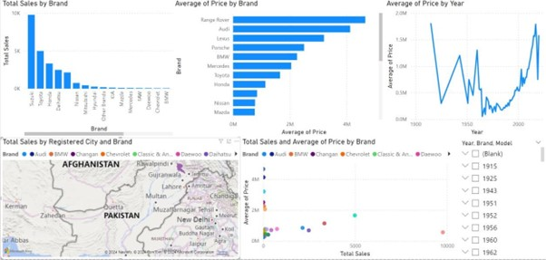

# Used Car Sales Analysis (OLX)

This project analyzes sales data for used cars listed on OLX to identify trends in sales volume and pricing.

## Business Problem
There was a lack of clarity on the optimal selling price for used cars.
The goal was to analyze sales performance by brand and over time to inform pricing strategies[cite: 224].

## Key Findings & Dashboard

* The analysis included 25,000 total sales listings.
* The data showed significant variation in average price by brand, with brands like Range Rover and Porsche at the higher end.
* A time-series analysis revealed sharp fluctuations in the average price of cars by year.
* Geospatial analysis showed the distribution of sales by registered city, with hubs in major metropolitan areas like Lahore.

## Tools Used
* Microsoft Power BI
* Microsoft Excel

## Files
* `Dashboard`: Screenshot of the interactive Power BI dashboard.
* `olx_car_data_csv.csv`: The dataset used for the analysis.
