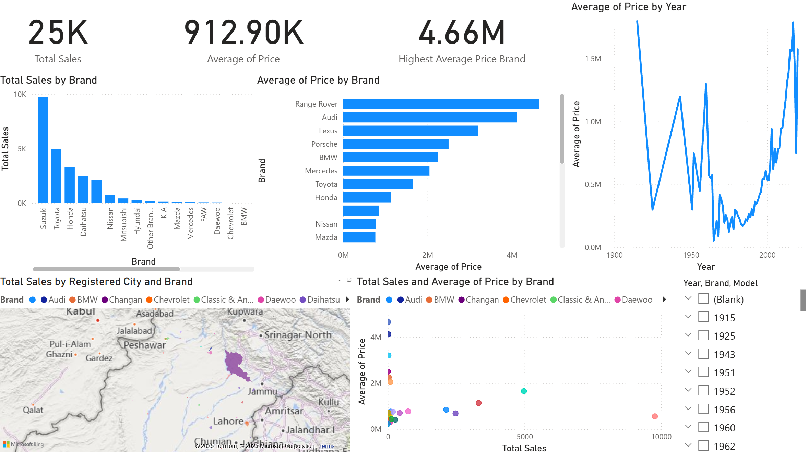

# OLX Used Car Price Optimization Analysis

This project analyzes over 25,000 used car listings from OLX Pakistan to identify key trends in sales volume and pricing. The goal is to provide data-driven insights that can help sellers and buyers make informed decisions on optimal pricing strategies.

## 🎯 Business Objective

The primary challenge addressed is the lack of clarity on optimal selling prices for used cars in a dynamic market. This analysis aims to identify how different factors—such as car brand, model year, and registration city—influence sales prices and volumes.

## 📊 Interactive Power BI Dashboard

A live, interactive Power BI dashboard was created to explore the dataset and its key findings.

**[➡️ View the Live Interactive Dashboard](https://app.powerbi.com/view?r=eyJrIjoiYmRlOWQ2MmMtZmQ5Ni00YTAxLTk4MDgtYjRhZjE3NjA1YTcyIiwidCI6ImZlZTNiOTE2LTAxYzEtNDk4Ny1hNjQ2LWUxOTM0MzJiOWVhYSIsImMiOjl9)**

## 📈 Key Insights

* **Brand-Level Pricing:** The analysis reveals significant price disparities across brands. Premium brands like **Range Rover**, **Audi**, and **Porsche** command the highest average selling prices, while brands like **Suzuki** and **Daihatsu** are more common in lower price brackets.
* **Geospatial Sales Hubs:** Sales are heavily concentrated in major metropolitan areas, with **Lahore**, **Karachi**, and **Islamabad** emerging as the top three cities for used car listings.
* **Price by Model Year:** A time-series analysis of car model years shows clear depreciation trends and price fluctuations, helping to determine the valuation of older vehicles.
* **Sales Volume Leaders:** **Toyota**, **Honda**, and **Suzuki** dominate the market in terms of the total number of listings, indicating high demand and supply for these brands.

## 🛠️ Tools & Data

* **Visualization:** Microsoft Power BI
* **Data Source:** The dataset used for this analysis contains 25,000 listings and is available in this repository.
    * [`olx_used_cars_dataset.csv`](./olx_used_cars_dataset.csv)
